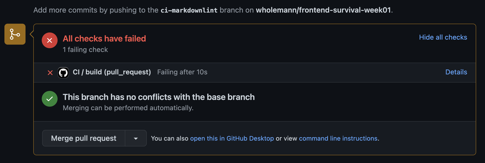

# 💯 과제(계속 써먹는 환경 설정 만들기)

교재에서 아샬이 제공한 레퍼런스처럼 프론트엔드 세팅을 위한 나만의 `README` 문서와 설정을 만들어 두면 매우 편합니다. 매번 프로젝트 때마다 문서를 따라서 생각없이 따라만 해도 세팅이 완료된다면 인지자원을 대단히 아낄 수 있습니다.

## ✅ **요구사항 1**

🧪 프론트엔드 개발 환경 설정 방법을 모아둔 `README.md`를 작성해주세요.

- 누구나 따라만 해도 동일한 프론트엔드 개발 환경이 설정되는 나만의 문서(`README.md`)를 작성합니다.
- 흐름은 [React + TypeScript + Parcel 설정](https://github.com/ahastudio/CodingLife/tree/main/20211008/react)를 참고하시되, 요즘은 방식이 다르므로 강의 내용을 바탕으로 하셔야 합니다.(예를 들어, main.tsx나 ESLint의 설정이 최신화 된 부분)
- 반드시 안내드린 [Markdown Lint](https://marketplace.visualstudio.com/items?itemName=DavidAnson.vscode-markdownlint)를 VS Code에 설치하시고 진행해주세요. 오류가 있을 땐 CI(Continuous Integration)에서 통과되지 않도록 해놨습니다.

## ✅ **요구사항 2**

🧪 강의에 나온 의존성들(Dependencies)을 설치하고, 설정파일들을 빠짐 없이 생성하고, 동일하게 작성해주세요.

- package.json에서 `scripts`를 빼먹은 게 있다면 여지없이 CI는 통과되지 않습니다.
- 강의에서 나온 디렉토리 구조와 다르거나, 빼먹은 파일(.gitignore, jest.config.js 등)이 있다면 역시 CI 통과되지 않습니다.

  

  (자주 보게 될 화면… Details를 눌러보시면 원인을 알 수 있습니다.)

- 한 번만 제대로 만들어두면 계속 써먹고 환경 설정 자체가 전혀 스트레스가 되지 않으니 꾹 참고 진행해주세요.

## ✅ 나의 풀이

- [링크](https://github.com/JaeMeDev/frontend-survival-week01/tree/JaeMeDev)